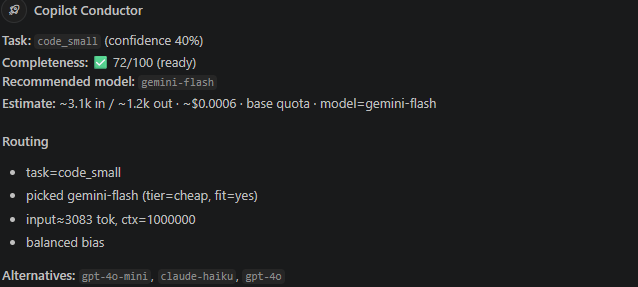

# Copilot Conductor

> Pick the right model. Validate the prompt. See the cost. Before you spend a premium request.

An open-source layer on top of **GitHub Copilot** that does three things every enterprise eventually asks for:

1. **Prompt validation** - scores completeness 0–100 and asks targeted follow-ups if the prompt is too vague to finish in one shot.
2. **Model routing** - picks the cheapest model that clears the quality bar for the task (trivial edit? reasoning? large refactor?).
3. **Cost estimation** - shows approximate tokens, USD, and premium requests *before* the call.

It ships as:

- **VS Code chat participant** (`@conductor`) - the primary UX, built on the `vscode.chat` + `vscode.lm` APIs.
- **MCP server** (`copilot-conductor-mcp`) - the same core exposed over Model Context Protocol, so it also works with **Copilot CLI**, Copilot agent mode, Claude Desktop, Cursor, etc.

100% local. No network calls. We don't proxy your prompts anywhere - we call `vscode.lm` (which uses your existing Copilot entitlement) or hand a decision back to the MCP client.

Read the full design: [docs/ANALYSIS.md](docs/ANALYSIS.md).

---

## Prerequisites

- **Node.js** ≥ 20 (`node -v` to check)
- **VS Code** ≥ 1.95
- **GitHub Copilot** extension installed and signed in (Business or Enterprise entitlement)

---

## Quick start

```bash
# 1. Clone and install dependencies
git clone https://github.com/<your-org>/copilot-conductor.git
cd copilot-conductor
npm install

# 2. Compile TypeScript
npm run compile
```

### Try the chat participant

1. Open this folder in VS Code.
2. Press **F5** → an **Extension Development Host** window opens.
3. In the new window, open **Copilot Chat** (Ctrl+Shift+I / Cmd+Shift+I).
4. Type:

```
@conductor add caching to fetchUser so repeated calls within 5s return the same result
```

5. You'll see output like this:

```
Task: code_small (confidence 78%)
Completeness: ✅ 72/100 (ready)
Recommended model: gpt-4o
Estimate: ~210 in / ~84 out · ~$0.002 · 1× premium · model=gpt-4o
```



Slash commands:

- `@conductor /validate <prompt>` - just the completeness report.
- `@conductor /route <prompt>` - pick a model (default; auto-forwards unless disabled).
- `@conductor /cost <prompt>` - tokens + $.
- `@conductor /explain <prompt>` - everything + the full candidate matrix.

### Try the MCP server

```bash
# Make sure you've already compiled (npm run compile)
node ./out/mcp-server.js
```

Register it with your MCP client. Example for **VS Code** (`.vscode/mcp.json`):

```json
{
  "servers": {
    "copilot-conductor": {
      "type": "stdio",
      "command": "node",
      "args": ["${workspaceFolder}/out/mcp-server.js"]
    }
  }
}
```

Example for **Copilot CLI** / Claude Desktop (`~/.config/.../mcp.json`):

```json
{
  "mcpServers": {
    "copilot-conductor": {
      "command": "npx",
      "args": ["-y", "copilot-conductor-mcp"]
    }
  }
}
```

Tools exposed:

| Tool | What it does |
|---|---|
| `analyze_prompt` | Full pipeline - redact, classify, validate, route, cost. |
| `validate_prompt` | Completeness score + follow-up questions. |
| `recommend_model` | Task classification + best model + alternatives. |
| `estimate_cost` | Tokens + USD against an auto-routed or named model. |
| `list_models` | The model catalog (prices, premium multipliers). |
| `redact_text` | Return a redacted copy using built-in + policy secret patterns. |
| `get_policy` | Return the loaded `.conductor.json` policy and its source path. |

---

## Configuration

VS Code settings (`settings.json`):

```json
{
  "copilotConductor.completenessThreshold": 60,
  "copilotConductor.autoForward": true,
  "copilotConductor.preferCheap": false,
  "copilotConductor.exactTokenCounts": true,
  "copilotConductor.llmJudge.enabled": true,
  "copilotConductor.llmJudge.confidenceThreshold": 0.6
}
```

### Policy (v0.2)

Drop a `.conductor.json` at your workspace root (or `~/.conductor/config.json`):

```json
{
  "allowModels": ["gpt-4o-mini", "gpt-4o", "claude-sonnet-4"],
  "denyModels": ["claude-opus"],
  "premiumModelsAllowedFor": ["code_large", "reasoning"],
  "redact": {
    "builtins": true,
    "patterns": ["CORP-[A-Z0-9]{12}"],
    "blockOnMatch": false
  },
  "audit": {
    "enabled": true,
    "path": ".conductor/audit.jsonl"
  },
  "llmJudge": { "enabled": true, "confidenceThreshold": 0.6 }
}
```

- **allow/deny/premium-for-task** — gate the model pool the router can pick from.
- **redact** — built-in detectors cover AWS keys, GitHub/Slack/OpenAI/Stripe tokens, JWTs, PEM private keys, Google API keys, generic high-entropy secrets. Matches are replaced with `[REDACTED:kind]` **before** anything leaves the pure functions — the forwarded prompt never contains raw secrets.
- **audit** — opt-in JSONL log of every decision (task, model, cost, redactions, verdict). Local file; no network.

### LLM-judge (v0.3)

When the rule-based classifier's confidence is below the threshold, Conductor asks a cheap LLM to double-check the task label. The judge auto-picks **the cheapest available `vscode.lm` model** (mini/haiku/flash/nano families first). Judge output is merged into the classification and surfaced in the summary (`🧠 llm-judge(...)`).

On by default. Turn off globally with `copilotConductor.llmJudge.enabled: false`, or per-repo with `"llmJudge": { "enabled": false }` in `.conductor.json`.

### Exact token counts (v0.3)

If `js-tiktoken` is installed (listed as an `optionalDependency`), Conductor uses it for exact token counts. Otherwise it falls back to the `chars/4` heuristic. The summary tags which mode is in use.

Model catalog, prices, and premium multipliers are plain data in
[`src/data/pricing.ts`](src/data/pricing.ts). Fork it, tune it, ship it.

---

## Architecture

```
┌─────────────────────────────────────────────────────────┐
│ VS Code Chat Participant (@conductor)                    │ ◄── primary UX
│ src/participant.ts                                       │
└────────────┬────────────────────────────────────────────┘
             │
             │             ┌───────────────────────────────┐
             ▼             ▼                               │
   ┌────────────────────────────────────┐                  │
   │ Core (src/core/)                   │   src/mcp-server.ts
   │   taskClassifier • promptValidator │ ◄── also exposed
   │   modelRouter • costEstimator      │     over MCP
   └────────────────────────────────────┘
             ▲
             │
   ┌─────────┴──────────┐
   │ src/data/pricing.ts │  ← model catalog, override per org
   └────────────────────┘
```

All four core modules are pure functions. No I/O, no globals, no network.
Easy to unit-test, easy to swap any piece (e.g. replace the rule-based
classifier with an LLM judge without touching the rest).

---

## Why this exists

GitHub Copilot Business/Enterprise bills per **premium request**. In practice,
most premium-request burn is caused by:

- users defaulting to the most powerful model for trivial edits, and
- vague prompts that require multiple expensive rounds to resolve.

Conductor attacks both. It's the cheapest lever an org can pull on Copilot
spend - and it composes with, rather than replaces, whatever Copilot does next.

---

## Roadmap

- [x] v0.1 - classifier, validator, router, cost, chat participant, MCP server.
- [x] v0.2 - `.conductor.json` policy (allow/deny/premium-gating) + secret redaction + JSONL audit log.
- [x] v0.3 - LLM-judge fallback classifier (auto-picks cheapest `vscode.lm` model) + `js-tiktoken` for exact counts.
- [ ] v0.4 - `vscode.lm.registerTool` so Copilot agent mode can call us directly.
- [ ] v0.5 - Server-side GitHub Copilot Extension for centralized org routing.

---

## License

MIT. See [LICENSE](LICENSE).
